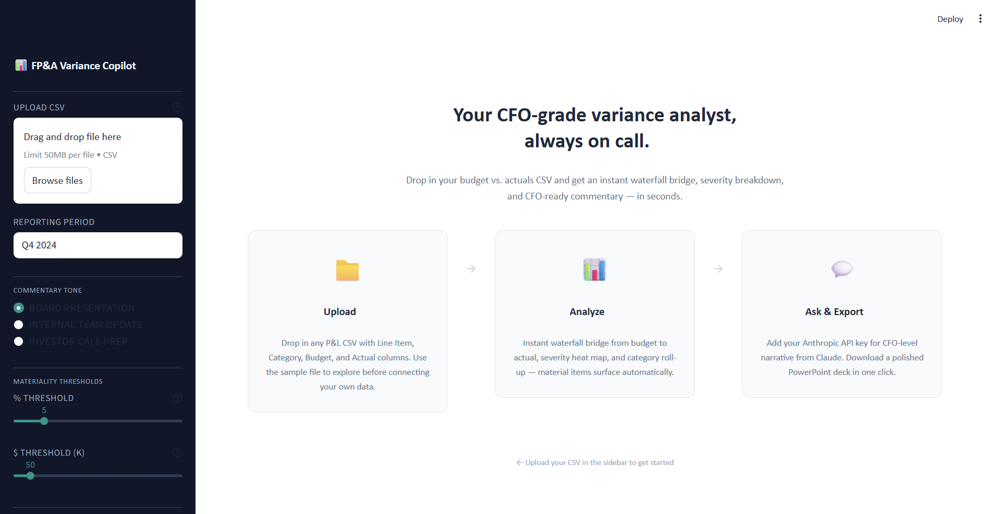

# FP&A Variance Copilot

**CFO-grade budget variance analysis in seconds — with tone-controlled AI commentary, natural language querying, and a forward projection engine that flags structural risks before they compound.**

Most variance tools show you the numbers. This one tells you what they mean, who needs to hear it, and what happens next quarter if nothing changes.

<!--  -->

---

## Why This Is Different

Every FP&A team produces a variance report. Almost none of them are useful. The analyst spends a day formatting a spreadsheet, the CFO asks the same three questions, and nobody flags that the cloud infrastructure overrun is on track to breach 20% of two-quarter budget.

This tool was built around three ideas that most variance tools skip entirely:

| Innovation | What it means in practice |
|---|---|
| **Tone-controlled commentary** | Board pack, team brief, and investor talking points — three structurally distinct outputs from the same data, not just adjusted adjective strength |
| **Natural language querying** | Ask "Why did we miss revenue?" or "Summarise this for my CFO in 2 sentences" — Claude has full access to all line items and the generated commentary |
| **Forward projection engine** | Run-rate modeling that projects material variances into next quarter and flags items where cumulative two-quarter exposure exceeds 20% of plan |

---

## Features

- **Instant variance computation** — upload any P&L CSV and get materiality flags, severity classification, and favorability scoring in under 5 seconds
- **Sign-convention-aware** — revenue categories use the revenue convention (more = good); cost categories use the cost convention (less = good) — automatically, from the category name
- **Dual-threshold materiality** — an item is material if `|Var%| ≥ threshold` OR `|Var$| ≥ threshold`; catches both large-percentage-small-dollar and small-percentage-large-dollar misses
- **Budget-to-actual waterfall** — a Plotly bridge chart that tells the story from plan to actual through each contributing variance
- **Three severity bands** — Critical (≥15%), Major (≥10%), Moderate (≥5%), Minor — so CFOs can triage at a glance
- **Three commentary tones** — Board Presentation, Internal Team Update (<300 words), Investor Call Prep (with anticipated Q&A) — all from the same data
- **Rule-based fallback** — full commentary with no API key needed; useful for demos, regulated environments, or offline use
- **Multi-turn chat** — ask follow-up questions about your variances; conversation history is preserved until a new file is uploaded
- **Forward projection** — material variances projected at dollar run-rate; at-risk items flagged where cumulative exposure breaches the 20% threshold
- **6-slide PowerPoint export** — management-pack quality deck with title, KPIs, waterfall, variance table, commentary, and forward look; appears after commentary is generated

<!--  -->

<!--  -->

---

## Quick Start

### 1. Clone and install

```bash
git clone https://github.com/priyankaChandramohan/fpa-variance-copilot.git
cd fpa-variance-copilot
pip install -r requirements.txt
```

### 2. Set your API key (optional)

Commentary and NL querying use Claude. Without a key, the rule-based fallback runs instead — the full UI still works.

```bash
# Option A: set as environment variable
export ANTHROPIC_API_KEY=sk-ant-...

# Option B: enter it in the sidebar at runtime (not persisted)
```

### 3. Run

```bash
streamlit run app.py
```

Open [http://localhost:8501](http://localhost:8501) in your browser. Upload `sample_data/actuals_vs_budget_q4_2024.csv` to explore with real data immediately.

---

## CSV Format

The tool requires exactly four columns. Column names are case-insensitive; surrounding whitespace is stripped automatically.

| Column | Type | Required | Description |
|--------|------|----------|-------------|
| `Line Item` | string | Yes | The P&L line description — e.g., "Cloud Infrastructure & Hosting" |
| `Category` | string | Yes | The grouping — determines the sign convention (see below) |
| `Budget` | number | Yes | Planned dollar amount for the period |
| `Actual` | number | Yes | Realised dollar amount for the period |
| `Period` | string | No | Informational only; the period label comes from the sidebar |

**Sign convention:** Any `Category` containing the words *revenue*, *sales*, *income*, *gross profit*, *gross margin*, or *other income* (case-insensitive) uses the revenue convention (Actual > Budget = favorable). All other categories use the cost convention (Actual < Budget = favorable).

**No formatting requirements on numbers** — dollar signs and commas are stripped during validation. A value like `$1,250,000` will parse correctly.

A sample file is included at `sample_data/actuals_vs_budget_q4_2024.csv` (20 P&L line items, ~$20M revenue range, Q4 2024).

---

## Architecture

```
fpa-variance-copilot/
│
├── app.py                  # Streamlit app — UI orchestration only, no business logic
├── variance_engine.py      # Computation core: validate, compute, summarize, waterfall data
├── charts.py               # Plotly chart functions: waterfall, grouped bar, donut, projection
├── commentary.py           # Tone-controlled commentary, NL querying, rule-based fallback
├── projection.py           # Forward run-rate projection and cumulative risk flagging
├── pptx_export.py          # 6-slide PowerPoint export via python-pptx
├── config.py               # All constants: thresholds, severity bands, color palette, prompts
│
├── sample_data/
│   └── actuals_vs_budget_q4_2024.csv   # 20-row Q4 2024 P&L for demos
│
├── notebooks/
│   └── methodology.ipynb   # Technical walkthrough: every algorithm explained with live outputs
│
└── requirements.txt
```

**Dependency rules:** `variance_engine` and `config` have no project imports. `charts` imports `config` only. `commentary` and `projection` import `variance_engine` and `config`. `pptx_export` imports all of the above. `app.py` imports everything and calls Streamlit. This enforces a clean dependency hierarchy with no circular imports.

---

## How It Works

### Variance Computation

`variance_engine.compute_variances()` adds five columns to the raw CSV:

1. **Variance ($)** = `Actual − Budget` (always arithmetic; sign not adjusted here)
2. **Variance (%)** = `Variance ($) / |Budget| × 100` — absolute-value denominator handles negative-budget lines
3. **Favorable** — applies the sign convention per category; a cost overrun is unfavorable even if Variance ($) is positive
4. **Severity** — maps `|Var%|` to Critical / Major / Moderate / Minor
5. **Material** — true if `|Var%| ≥ mat_pct` OR `|Var$| ≥ mat_abs` (dual threshold; both configurable via sidebar sliders)

### Waterfall Chart

The bridge builds an ordered sequence: `Budget (absolute)` → sorted material variances `(relative)` → `Other net (relative)` → `Actual (absolute)`. The "Other net" bar absorbs all sub-threshold variances so the chart always closes arithmetically to Actual. Plotly's `go.Waterfall` handles the stacking.

### Tone-Controlled Commentary

Each tone has a structurally distinct system prompt — not just a different adjective register. Board Presentation groups variances thematically and asks for three specific recommendations. Internal Team Update enforces a 300-word cap and requires functional owner assignments per item. Investor Call Prep includes anticipated Q&A and explicit language guidance (phrases to use, phrases to avoid).

When no API key is provided, a rule-based engine computes the same section structure from DataFrame values. The fallback output matches the AI prompt's section order so users can see exactly what the AI is expected to produce.

### Natural Language Querying

`commentary.answer_question()` injects the full variance context (all line items, category summary, and any previously generated commentary) into the system prompt on every turn. The conversation history is capped at 10 turns to stay within context limits. The data context format uses pipe-delimited labeled fields rather than JSON — more token-efficient and more reliably parsed by the model.

### Forward Projection

Material variances are projected at dollar run-rate (same absolute $ variance next quarter). Non-material variances are assumed to normalise to zero — projecting noise would amplify it. The risk flag fires when a line item is unfavorable AND its cumulative two-quarter variance exceeds 20% of the combined two-quarter budget. The cumulative view distinguishes one-off misses from structural problems.

---

## Tech Stack

| Layer | Technology |
|-------|-----------|
| UI framework | [Streamlit](https://streamlit.io) |
| Data manipulation | [pandas](https://pandas.pydata.org) + [NumPy](https://numpy.org) |
| Visualisation | [Plotly](https://plotly.com/python/) |
| AI commentary | [Anthropic Claude](https://www.anthropic.com) (`claude-sonnet-4-20250514`) |
| PowerPoint export | [python-pptx](https://python-pptx.readthedocs.io) |
| Chart → image | [kaleido](https://github.com/plotly/Kaleido) (optional; for PPTX chart images) |
| Methodology docs | [Jupyter](https://jupyter.org) |

---

## Methodology Notebook

`notebooks/methodology.ipynb` is a standalone technical walkthrough of every algorithm in the tool — sign convention design, dual-threshold materiality, waterfall arithmetic, prompt engineering decisions, and projection risk flagging — with live outputs on the sample data.

If you want to understand the thinking behind a design decision, start there.

---

## Roadmap

- [ ] **Multi-period trend analysis** — upload N quarters of data; detect recurring vs. one-time variances automatically based on persistence across periods
- [ ] **Variance decomposition** — price × volume × mix drill-down for revenue lines; isolate how much of a revenue miss is attributable to pricing decisions vs. volume shortfall vs. product mix shift
- [ ] **Slack / Teams integration** — automated monthly report delivery; configure a channel and a schedule, and the tool pushes the commentary and waterfall image at period close
- [ ] **PDF export** — render the same 6-slide content as a PDF for organisations where PPTX isn't the standard delivery format
- [ ] **Multi-currency support** — FX conversion layer with configurable rates for companies reporting in multiple currencies
- [ ] **Reforecast scenarios** — side-by-side comparison of original budget vs. revised forecast vs. actuals, with variance attribution to forecast accuracy

---

## Author

**Priyanka Chandramohan**

[](https://www.linkedin.com/in/priyankachandramohan)
[](https://github.com/priyankaChandramohan)

---

*Built as a portfolio project demonstrating FP&A domain knowledge, LLM prompt engineering, and production-quality Python application design.*
